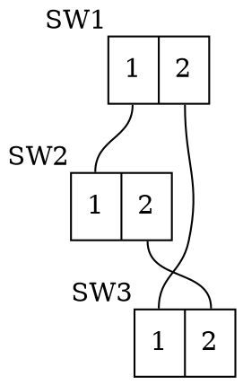

# Spanning Tree Protocol (STP) Simulator

## Overview
The **Spanning Tree Protocol (STP) Simulator** is a Python-based tool that allows users to simulate the behavior of the Spanning Tree Protocol in a network. The application uses Streamlit for its user interface and supports visualizing network topologies and simulation results.

## Features
- Upload network topology files in DOT format.
- Simulate the Spanning Tree Protocol for a configurable number of steps.
- Visualize the network topology as an interactive graph.
- Display detailed simulation results, including port roles, statuses, and costs.

## Requirements
- Python 3.8 or higher
- Streamlit
- NetworkX
- Pyvis
- Netaddr

## Installation
1. Clone the repository:
   ```bash
   git clone <repository-url>
   cd network-simulation
   ```
2. Install the required dependencies:
   ```bash
   pip install -r requirements.txt
   ```

## Usage
1. Run the Streamlit application:
   ```bash
   streamlit run main.py
   ```
2. Open the application in your browser (usually at `http://localhost:8501`).
3. Upload a DOT file describing the network topology.
4. Configure the number of simulation steps using the slider.
5. The simulation will auto run once a file is uploaded.

## File Structure
- `main.py`: The main application file.
- `example-files/`: Contains example DOT files for testing.
  - `example-1.dot`
  - `example-2.dot`
  - `example-3.dot`

## Example DOT File Format
Below is an example of a valid DOT file format for the simulator:


## Acknowledgments
- Built with [Streamlit](https://streamlit.io/).
- Network topology parsing with [NetworkX](https://networkx.org/).